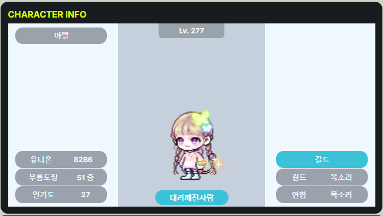
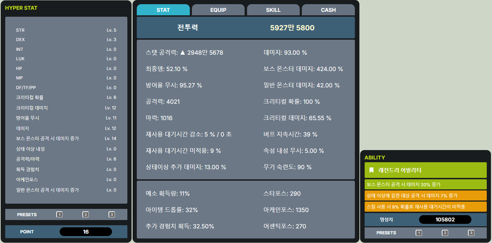
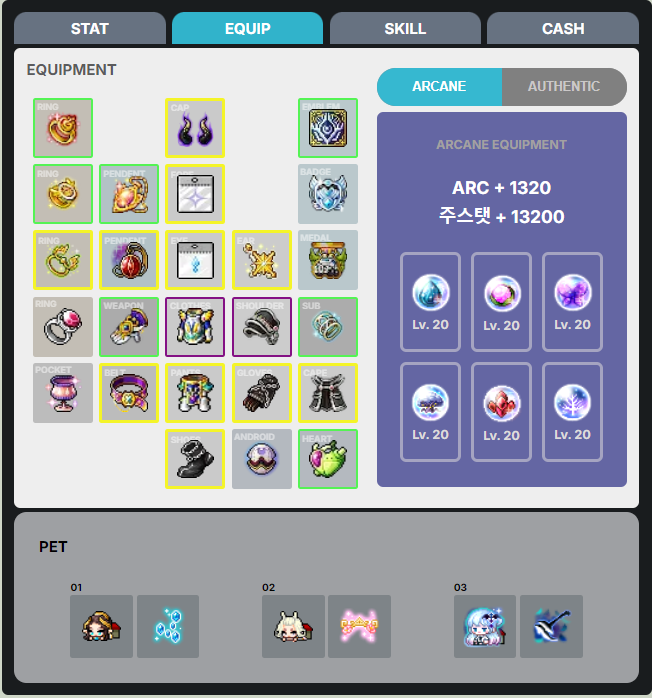
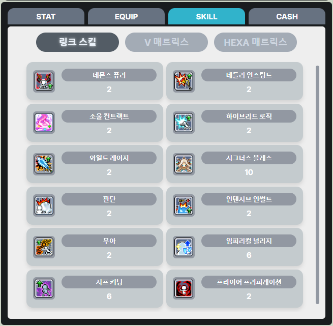
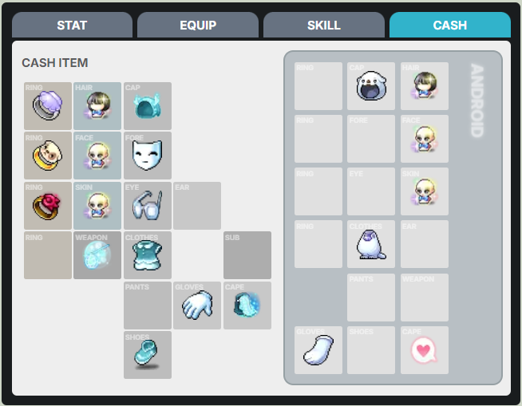

### 공부할 겸 만들어본 next_nexon_openAPI

### Preview

#### 캐릭터 기본



#### 캐릭터 스탯



#### 캐릭터 장비



#### 캐릭터 스킬



#### 캐릭터 캐시



<br>
<br>
<br>

- 필수

1. 기본적인 인게임 UI 디자인, 아이템 등에 올려놓았을 경우 더욱 정확한 정보를 띄워줄 수 있는 창을 만들면 완성 될 듯..

<br>
<br>

- 있으면 좋은 것들

```
1. 길드 인원 정보
2. 유니온 & 아티팩트 형태
3. 그랜드 어센틱 심볼 UI(이건 어떻게 생겼는지 아직 잘 모르겠다..) 
```

<br>
<br>